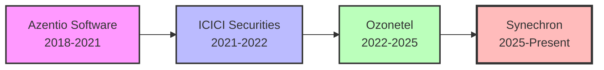

# 👋 Hi, I'm Sushilkumar Barai

<div align="center">

### 🚀 Sr. Associate – AI/ML | Data Scientist | Python Developer | GenAI & NLP Specialist

[](https://linkedin.com/in/sushilkumarbarai)
[](https://github.com/SushilkumarBarai)
[](mailto:sushilkumarbarai123456@gmail.com)
[](tel:8286755226)


</div>

---

## 🧠 About Me


**Experienced AI/ML Engineer | 7.0 Years Driving Business Impact Through Intelligent Automation**

I'm a results-driven Data Scientist and Python AI/ML Developer specializing in **financial services**, **NLP**, **LLMs**, **agentic AI**, and **end-to-end ML solutions**. With deep expertise in the NBFC and BFSI domains, I build scalable, production-ready systems that transform data into actionable business value.

### 🎯 Core Expertise

- 🤖 **Generative AI & LLMs:** Building intelligent chatbots, voicebots, and conversational AI using LangChain, OpenAI GPT-4o, DeepSeek R1, and Ollama
- 🗣️ **Speech & Voice Technologies:** Real-time ASR/TTS systems, IVR bots, voice streaming, and multilingual voice analytics
- 📊 **ML & Data Science:** Customer segmentation, predictive modeling, time series forecasting, and behavioral analytics at scale
- 🔄 **ETL & Data Engineering:** Scalable pipelines with MongoDB, Firebase, vector databases (FAISS, Pinecone), and cloud platforms
- 🏦 **Domain Knowledge:** Credit scoring, customer profiling, financial product recommendations, and FX settlement automation

<br clear="right"/>

---

## 💼 Professional Journey



| Company | Role | Duration |
|---------|------|----------|
| **🏢 Synechron Technology, Pune** | Senior Associate – AI/ML & Data Science | Feb 2025 – Present |
| **🏢 Ozonetel Communication, Hyderabad** | Python Developer (Speech & AI) | Dec 2022 – Feb 2025 |
| **🏢 ICICI Securities, Navi Mumbai** | Data Scientist | Jul 2021 – Dec 2022 |
| **🏢 Azentio Software, Navi Mumbai** | Software Engineer | Sep 2018 – Jul 2021 |

---

## 🚀 Featured Projects

<details open>
<summary><b>🌐 Global Foreign Exchange (GFX) Settlement Automation</b></summary>
<br>

Built an AI-powered full-stack solution automating global FX settlement workflows—from data ingestion to validation and communication.

**📈 Impact:**
- ✅ Automated end-to-end settlement operations, reducing manual processing time and operational errors
- ✅ Integrated with multiple financial APIs to handle high-volume transaction data
- ✅ Implemented NLP-driven email and PDF processing for intelligent document handling

**🛠️ Tech Stack:** `Python` `FastAPI` `NLP` `REST APIs` `Outlook Automation` `Financial Data Processing`

</details>

<details>
<summary><b>💰 Customer Segmentation for Financial Products</b></summary>
<br>

Designed a machine learning solution for an NBFC to segment 4M+ customers based on financial behavior, enabling personalized product recommendations.

**📈 Impact:**
- ✅ **15% improvement** in customer retention through targeted engagement
- ✅ **22% revenue increase** via data-driven cross-selling and upselling
- ✅ **35% reduction** in operational costs through automation

**🛠️ Tech Stack:** `Random Forest` `XGBoost` `Python` `SQL` `CRM Integration`

</details>

<details>
<summary><b>🎤 Voice Data Lake – Audio Intelligence Platform</b></summary>
<br>

Built an enterprise-grade platform for automated ingestion, processing, and analysis of contact center audio data at scale.

**📈 Impact:**
- ✅ Reduced time-to-insight from **days to minutes** for product and support teams
- ✅ Enabled semantic search across millions of calls for instant retrieval
- ✅ Powered real-time sentiment analysis and voice-to-insight transformation for leadership decisions

**🛠️ Tech Stack:** `Whisper ASR` `NLP` `Vector Databases (FAISS)` `Speaker Diarization` `RESTful APIs` `Cloud Infrastructure`

</details>

<details>
<summary><b>📊 AI-Powered Option Chain & Derivatives Analysis Copilot</b></summary>
<br>

Developed a real-time trading copilot leveraging LLMs and market analytics to generate explainable trading signals.

**📈 Impact:**
- ✅ Reduced analysis-to-action latency, enabling **millisecond responses** to market shifts
- ✅ **25% boost** in trader productivity through LLM-powered insights
- ✅ Enhanced cross-team collaboration with standardized dashboards and narrative explanations

**🛠️ Tech Stack:** `DeepSeek R1` `LLaMA` `Real-time Data Streaming` `AWS/Azure` `Volatility Analysis` `LangChain`

</details>

---

## 🧰 Tech Stack

<div align="center">

### Languages & Frameworks


### AI/ML & LLMs


### Speech Technologies


### Cloud & DevOps


### Databases


</div>

---

## 📊 GitHub Stats

<div align="center">
  
  
</div>

<div align="center">
  
</div>

<div align="center">
  
</div>

---

## 🎓 Education

**🎓 Bachelor of Engineering in Computer Engineering**  
Yadavrao Tasgaonkar Institute of Engineering & Technology, Mumbai University  
*CGPA: 7.12*

---

## 💡 What Drives Me

<div align="center">

```python
class DataScientist:
    def __init__(self):
        self.name = "Sushilkumar Barai"
        self.role = "Sr. AI/ML Engineer"
        self.passions = ["LLM Research", "Production ML", "Financial Analytics"]
    
    def say_hi(self):
        print("Let's build something impactful together!")

me = DataScientist()
me.say_hi()
```

</div>

- 🔬 Exploring cutting-edge AI/ML research and LLM advancements
- 🏗️ Building scalable, production-grade ML systems
- 📈 Financial market analytics and algorithmic trading
- 🌐 Contributing to open-source AI projects

---

<div align="center">

### 📫 Let's Connect!

[](https://linkedin.com/in/sushilkumarbarai)
[](https://github.com/SushilkumarBarai)
[](mailto:sushilkumarbarai123456@gmail.com)


---

*Thanks for visiting! Let's collaborate and create innovative AI solutions together.* ✨

</div>
